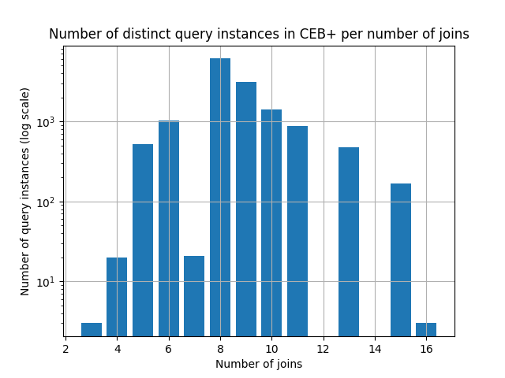
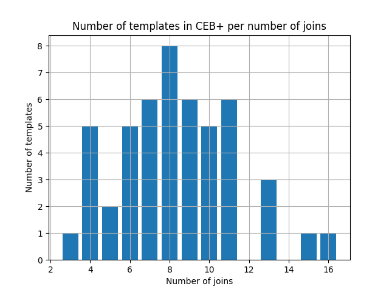
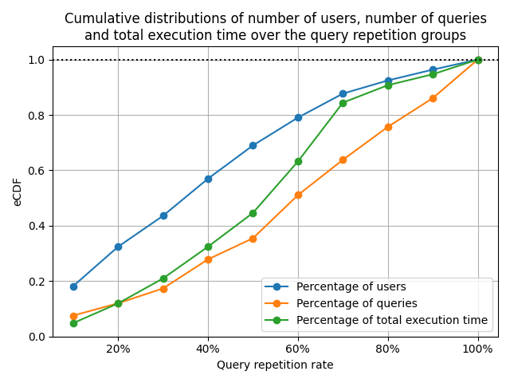
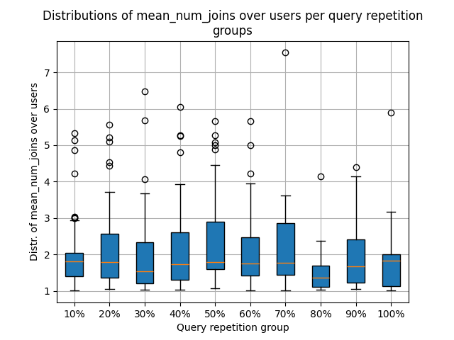
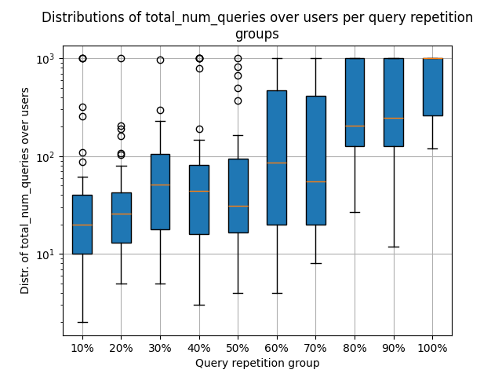

# Redbench Generation

## Definitions
* The readset of a query, called `read_table_ids` in Redset, is the set of distinct tables it scans.
* Redset user: Defined by a `user_id` and an `instance_id`. In Redset, `instance_id` referes to the cluster's id.
* Query hash of a Redset query: Hash that we use to decide whether two queries are the same. Redset includes a `feature_fingerprint` column that is a "proxy for query similarity". They warn that this fingerprint might have false positives. We found cases where this fingerprint can be equal for two different queries with different numbers of joins or scans, or different readsets. To correct such discrepancies, we define our own query hash as the combination of `feature_fingerprint`, `num_scans`, `num_joins`, and `readset`.
* Query repetition rate is defined for a Redset user as the ratio of his queries that have already occured before (based on the query hash). Notice that the repetition rate can never be 100% since the first occurence of a query hash does not count as a repetition.

## Support Benchmarks

We use the IMDb benchmarks CEB and JOB. Both are defined in terms of query templates that can be freely instantiated. We use pre-instantiated versions of CEB and JOB, which we combine together for more distinct templates and query instances to sample from.

&nbsp; | Number of query instances | Number of templates
--- | --- | ---
CEB | 13646 | 16
JOB | 113 | 33
Total (CEB+) | 13759 | 49

> [!NOTE]  
> In the remainder of this document, CEB+ will always refer to the combination of CEB and JOB.

 

Later, while sampling workloads, we will map user queries to CEB+ queries based on their normalized number of joins -> we want to have as many distinct templates and query instances for each possible value of number of joins. Therefore, we only keep queries with number of joins between `6` and `11`. The choice of these values is empirical.

&nbsp; | Number of remaining query instances | Number of remaining templates
--- | --- | ---
CEB | 12498 / 13646 | 13 / 16
JOB | 79 / 113 | 23 / 33
Total (CEB+) | 12577 / 13759 | 36 / 49

## Redset Setup
Redset is a dataset of customer query metadata, spanning over 3 months and 200 clusters, published by Redshift. Redset comes in two types: `provisioned` and `serverless`. We use the `provisioned` version and prefilter as follows:

1. We exclude:
    * non-select queries, i.e., `query_type != 'select'`.
    * queries that scan external tables, i.e., `num_external_tables_accessed > 0`.
    * queries that scan system tables, i.e., `num_system_tables_accessed > 0`.
    * queries that do not scan any table, i.e., `read_table_ids is null`.
    * queries with no joins, i.e., `num_joins = 0`.
    * queries that were answered from result cache, i.e., `was_cached = 1`.
    * queries with `num_joins` != |readset| - 1. We want the readset to uniquely identify `num_joins`.
1. For each user:
    * We find the week where they issued (based on `arrival_timestamp`) the most queries. A week starts on Monday 8am and ends on Friday 5pm.
    * We only keep the queries from that week.
3. We take the remaining queries from the previous step, we keep at most the first 1000 queries of each user, sorted by `arrival_timestamp`.
4. We take the remaining queries from the previous step and exclude:
    * users where `max_num_joins - min_num_joins > 11`.
        * The intuition is that if the gap between `min_num_joins` and `max_num_joins` is too big, too many Redset queries with different numbers of joins will be mapped to the same number of joins in CEB+ queries later during workload sampling → risk of overestimating repetition.
    * users where `max_num_joins == min_num_joins`.
        * Later, during the workload sampling, we will need to normalize the number of joins. Equal min and max values prevent us from normalizing (divide by 0).

→ Remaining Redset queries: `65188 / 441.35M` queries.

→ Remaining Redset users: `340 / 192608` users.

> [!NOTE]  
> In the remainder of this README, Redset will always refer to this prefiltered version.

     

## Redset User Sampling
From each of the 10 query repetition groups `0% - 10%`, `10% - 20%` up to `90% - 100%`, we pick 3 users as follows:
* We rank the users in ascending order:
    * once based on the number of distinct `num_joins` values across their queries.
    * and once on the number of distinct `readsets` across their queries.
* We sum up both ranks for each user to get the user's `workload_variabality`. A lower `workload_variabality` value means less distinct queries in terms of number of joins and readsets.
* We select the users with the lowest, median, and highest `workload_variabality` values.

→ this ensures more diverse workloads in Redbench.

Example:

The figure shows both ranks on the x- and y-axis for each user in the 20%-30% query repetition group. Summing up both dimensions for each user to get `workload_variability` corresponds to computing the manhattan distance. The dotted line represents the points that have a manhattan distance equal to the median `workload_variability`. The median `workload_variability` user (orange dot in the figure) that we sample must lie on this line. Every point above the line has a higher variability, and vice versa.

## Workload Sampling
We want to map each sampled user's query timeline to a sequence of CEB+ queries. To do so, we iterate over the timeline and for each query:
* `user_query_hash` already seen before -> use the CEB+ query instance mapped to it.
* `user_query_hash` hash never seen before. We want to build a bijection `user_query_readset <-> ceb+_template`:
    * (1) We have already seen `user_query_readset` before, i.e., `user_query_readset` has a `ceb+_template` mapped to it:
        * (2) `ceb+_template` has unused query instances -> use one of its unused query instances.
        * (3) `ceb+_template` has no unused query instance -> fallback to (6 or 7).
    * (4) We haven't seen `user_query_readset` before, i.e., `user_query_readset` has no `ceb+_template` mapped to it:

        `closest_ceb+_queries`: All CEB+ queries with the closest number of joins as the user's query, after normalizing both to values between 0 and 1.

        `closest_ceb+_templates`: Templates of the `closest_ceb+_queries`.

        * (5) At least one of the `closest_ceb+_templates` is still **unmapped** -> pick the one with the most number of query instances, insert the mapping `ceb+_template <-> user_readset`, and use one of the unused query instances of `ceb+_template`.
        * (6) At least one of the already **mapped** `closest_ceb+_templates` has unused query instances -> pick one randomly and use one of its unused query instances.
        * (7) None of the `closest_ceb+_templates` has unused query instances -> use one of the query instances in `closest_ceb+_queries`

Notice:
* Steps `(2)` and `(5)` are happy paths.
* Reaching step `(7)` means that CEB+ doesn't have enough **query instances** to mimic the user's workload.
* Follwing the path `(3 -> 6)` or `(3 -> 7)` means that some **CEB+ readsets** don't have enough **query instances** to mimic the user's workload.
* Following the path `(4 -> 6)` means that CEB+ doesn't have enough **distinct readsets** to mimic the user's workload.
* Statistics on how often we follow each path can be found in `workloads/<group>/stats.csv`.

## Result
Each subdirectory of `workloads/` represents a query repetition group between `0% - 10%` to `90% - 100%` and contains:

* One CSV file named `stats.csv` containing stats about the workload sampling step.
* For each of the 3 sampled users, one CSV file describing the sampled workload.

Running Redbench boils down to converting the 30 CSV files to SQL files (`setup.py`), running them, and measuring execution times.

## Future Ideas
* In steps (5) and (6) of the sampling process, instead of choosing a `ceb+_template` randomly or based on the number of remaining query instances, we can simulate the sampling process differently to find the optimal choosing strategy to minimze the numbers of time we reach the steps (6) and (7).
* To artificially augment the data, we can partition each user's queries timeline into disjunct blocks of 1000 consecutive queries each. Each block counts as an artifical new user, e.g., for a user with 2003 queries, we will end up with 3 artifical users with 1000, 1000, and 3 queries respectively.
    * But, this might result in overrepresenting original users that have too many queries.
* The current version of Redbench only considers SELECT queries. For cerain use cases, this might not be enough, e.g., to benchmark caching techniques where updates would invalidate the caches. Redset includes a `write_table_ids` column that we can make use of.
